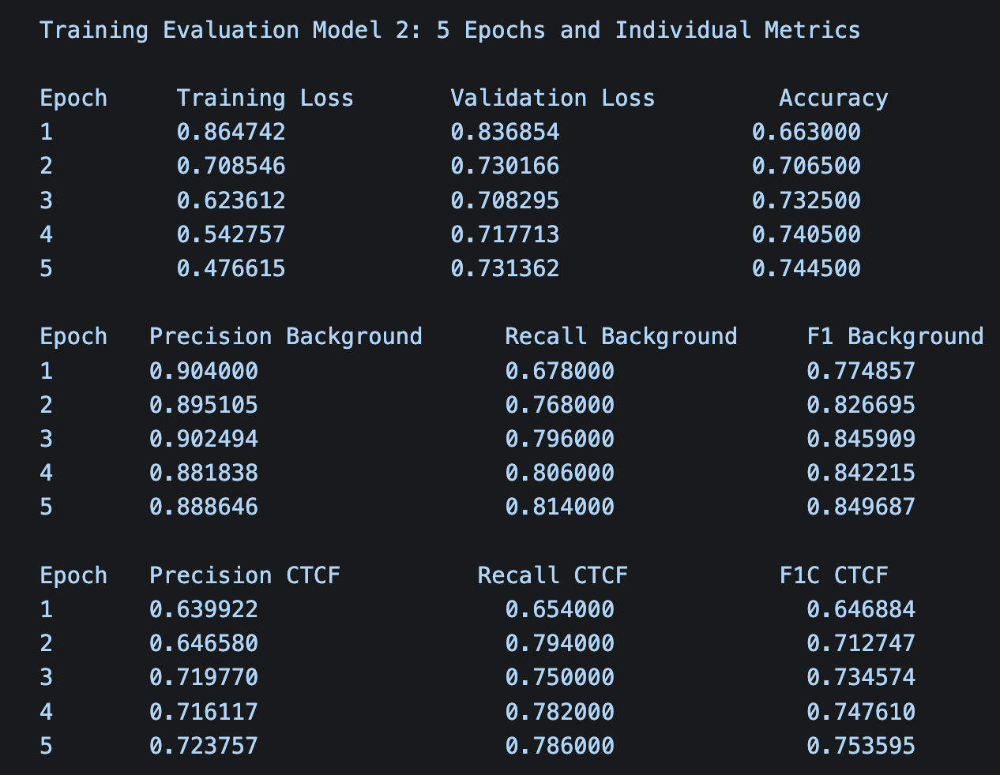
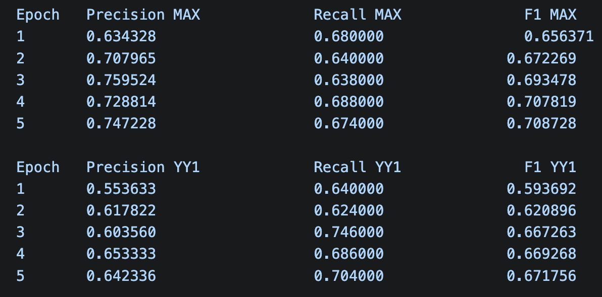
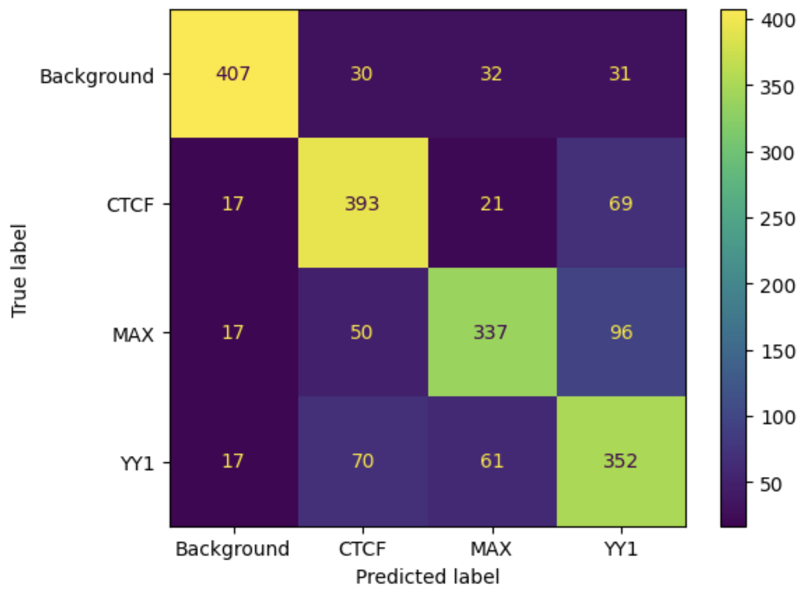
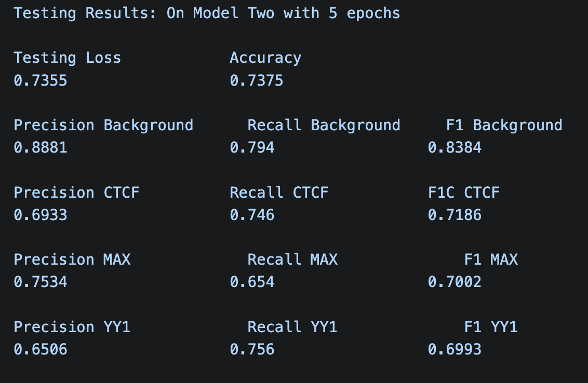

# A transformer model predicting transcription factor binding sites vs background DNA:

This project implements a transformer-based model named DNABERT to predict whether a given DNA sequence contains a transcription factor binding site. Traditional binding site search algorithms rely on fixed sequence patterns that cannot capture the contextual and combinatorial nature of transcription factor binding and cannot track  interactions between distant genomic regions. While some binding sites are uniquely identifiable through known motifs, long distance dependencies and sequence variations make accurate transcription factor binding site prediction challenging.  
  
Transformers can learn sequence dependencies and binding site interactions directly from the data, modeling long-distance effects, sequence context and variant sensitivity. Successful transcription factor prediction has broad research implications including improved accuracy over traditional models and uncovering novel biological insights from data.  
  
For this project, genomic sequence data was obtained from the Encode Project using ChIP-seq experiments. Sequences were then extracted from the hg38 genome. This included background genomic sequences deemed non-binding.  
  
DNA sequences of 3 transcription factors (CTCF, MAX and YY1) were converted into k-mer tokens to help the model learn biologically meaningful motifs and relationships between nearby and distant nucleotides using its attention mechanism.   
  
Model performance was tested using accuracy, precision, recall and F1 scores across categories to quantify classification quality.  
  
# Data Sources:
* https://www.encodeproject.org/
    * For individual TF binding sites.
* hg38 human genome.
  
# Tools & Techniques:
* HuggingFace, PyTorch, Pandas
* Model: “zhihan1996/DNA_bert_6”
  
# Results:

  
# Challenges & Lessons Learned:
* The biggest challenge was working with training times and Colab timing out. 
* With more time, I would experiment tuning the model more, diving further into the details to see what impacts performance scores.
* Using Pytorch for the first time wasn’t bad since the same concepts apply as other ML libraries.  
  
# Conclusions & Future Work:
* I’m satisfied with the model’s performance. Though, without a benchmark to compare it to, I’m curious if this is an improvement vs. other ML approaches for transcription factor binding site predictions.
* It would be interesting to dive deeper into the nature of the 3 transcription factors binding sites, what makes then unique or similar, and why YY1 was being mis-predicted as much as it was.
* It would be great to revisit transformer architectures and papers, dive deeper into the math behind DNABERT and similar models, understand the self-attention mechanism at the finest level and how it applies to the genomics domain.  
  
# Bibliography:
  
Vaswani, Ashish, et al. “Attention Is All You Need.” Advances in Neural Information Processing Systems, vol. 30, 2017, pp. 5998–6008.  
  
Summary:  
This is the canonical transformer paper! The paper describes the original architecture with multi-headed self-attention mechanisms. This mechanism allows each token to compare itself with every other token in the same sequence. It runs parallel attention heads to learn different types of relationship with the corpus. This also allows for improved long-range dependency modeling which improves the model’s contextual understanding. The transformer uses an encoder-decoder architecture to understand an input sequence and then generate an output sequence.  
  
The feed forward network and self-attention mechanism proved more efficient and
scalable than traditional recurrence mechanisms by allowing tokens to be processed all at once and thus significantly improving training time. The reduction in training time was a notable benefit of this new, more efficient architecture trained on 8 GPUs. Their experiments showed just how powerful transformers were at translating text. My
understanding is that once this paper and architecture were released, transformers
were scaled to process enormous bodies of text on thousands of GPUs, leading to
genAI as we know it today.  
  
Avsec, Žiga, et al. “Effective Gene Expression Prediction from Sequence by Integrating Long-Range Interactions.” Nature Methods, vol. 18, 2021, pp. 1196–1203.  
  
Summary:
The premise of this article is that non-coding nucleotide sequences have a documented impact on gene expression. The research explored the use of deep learning models in improving gene expression prediction accuracy. They created a model named “Enformer” (enhancer + transformer) that can integrate information from up to 100kb away in the genome; ie: long-range dependency modeling. They achieved this through attention layers that transformed input sequence positions by computing weighted relationships across all sequence positions.
  
The results showed more accurate variant effect predictions in both human and mouse DNA sequences. “Variant effect predictions” allow us to understand whether changes in genomic sequence create benign phenotypes or harmful phenotypes, or perhaps changes in gene expression. Enformer was also capable of learning to predict enhancer-promoter interactions directly from the genomic sequence. Enhancers and promoters work together to control spatial and temporal gene expression and can often be found in distant parts of a genome. This underlines the need for and the power of the transformer architecture in working with gene expression predictions.  
  
Ji, Yanrong, et al. "DNABERT: Pre-trained Bidirectional Encoder Representations from Transformers Model for DNA-language in Genome." Bioinformatics, vol. 37, no. 15, 1 Aug. 2021, pp. 2112–2120.  
  
Summary:
This is the original DNABERT article. The team of researchers demonstrated that their pre-trained transformer model architecture improved performance with the prediction of promoters, splice sites and transcription factor binding sites. They were able to create a model that understands DNA “globally” from unlabeled data. The attention mechanism of transformers helps capture this global data. Interestingly, they still had great performance from scarce data. They were able to discover potential genetic relationships without human involvement. And, this research is applicable to organisms beyond humans.  
  
K-mer tokenization of DNA input sequences and the subsequent embedding process is
introduced here in the materials and methods section; an approach I will try during my implementation for transcription factor binding sites. Contextual information is captured using the multi-headed self-attention mechanism. They were able to:
* Predict proximal and core promoter regions,
* Identify transcription factor binding sites,
* Visualize important regions and sequence motifs
* Recognize both canonical and non-canonical splice sites
* Identify functional genetic variants
* Found value in pre-training for both their purposes and generalizations to other
organism
  
The results in this article show just how powerful the transformer architecture is at solving certain computational biology tasks!  
  
Zhou, Zhihan, et al. “DNABERT-2: Efficient Foundation Model and Benchmark for
Multi-Species Genome.” arXiv, arXiv:2306.15006, 18 Mar. 2024.  
  
Summary:
This article is by some of the same authors as the previous article. They propose
DNABERT-2 which moves away from k-mer tokenization to Byte Pair Encoding. This
compression algorithm allows them to merge the most frequent co-occurring genomic
sequences in their training corpus and avoids the overlaps of k-mer tokenization. It also improves input length constraints. This vastly improves training times, memory use, and improves model performance on 23 of 28 datasets when compared to DNABERT.  
  
While interesting and bringing us closer to the cutting edge in transformer use in solving genomic sequence problems, the information in this article does not move the needle too much for my project. I anticipate using and learning from older, more simplified methods. At this junction, that reduction in complexity is perfect for developing my understanding of transformer use in computation biology.  
  
Zhou, Zhihan, et al. “DNABERT-S: Pioneering Species Differentiation with Species-Aware DNA Embeddings.” Bioinformatics, vol. 41, suppl. 1, July 2025, pp.i255–i264. Oxford University Press. 
  
Summary:
DNABERT-S was published on the heels of DNABERT-2’s article with Zhihan Zhou as
first author. Here, embedding methods are used to differentiate species and use
DNABERT-2. They introduce a couple different novel methods, including:
* Manifold Instance Mixup, that mixes hidden representations in DNA at randomly
selected layers of the transformer and then trains the model to recognize the
mixed proportions at the output layer.
* The Curriculum Contrastive Learning strategy which splits the training process
into two, which creates more challenging anchors.  
  
This new model improved performance in label-scarce scenarios like identifying more species from unlabeled genomic data as well as several more performance metrics.  
  
There isn’t much for me to pull from here at this time. I’ll be going back to some of the earlier articles as I begin the process of closely planning and implementing my project. that way I can continually learn about transformer architecture and their applications in computational biology and genomics.
